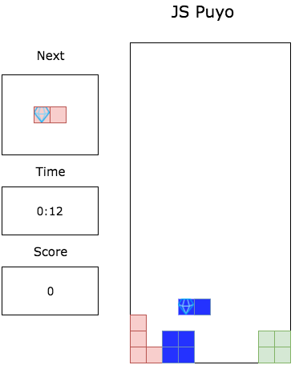
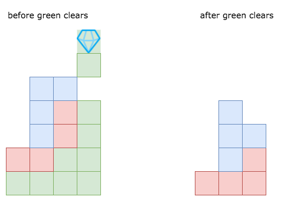

# JS Pop
___
### About JS Pop

JS Pop is a single-player variation on the Puyo Pop game where two-block rectangles
of different colors drop from the top of the screen and can be shifted and
rotated in the air to form a pile at the bottom. Scoring is handled by
clearing collections of various colors with special breaker blocks which
periodically drop and clear all blocks that share a side of the same color
that reach up to where the breaker block lands. Longer chains result in higher
score, and the game progresses with random blocks falling until they reach
the top and there is no more space for a block to fall in.

## Functionality & MVP

The game should be a working version of single-player Puyo Pop with:
- a welcome/controls splash
- active running game board that clears blocks when breaker blocks of a matching
color touches it or an adjacent block of the same color.
- blocks correctly fall when no longer supported after a break.
- next block up display
- appropriate score/game time display.

## Wireframe

The game should replicate the usual 10x20 square board, have a display for the next pair to drop, score/time display and a splash for the rules before the game begins.

## Architecture and packages

This project will primarily use canvas via Easel.js to render the
game state and advance the position of the falling tiles. Webpack will
be used to collate and load all files in the program. JQuery will be used to
access and interact with the canvas.

### File Structure

- board.js: Renders board, tracks filled tiles, holds block queue, input logic.
- puyo.js: holds logic for generating blocks, class information for color,
breaker status, active or not.
- game.js: Holds scoring logic, game-over check.

## Implementation Plan

Day 1:
General set-up. Get webpack and packages set-up/installed. Establish a
base html document with an canvas instance. Start working with setting up
easel.

Day 2:
Establish board class and methods. Get easel ticking running. Create logic
for randomized block generation (and guaranteed breaker block generation),
score and time counters, etc.

Day 3:
Inputs and splash/instructions page. User Controls.

Day4:
Bugfixing and styling touches. Potentially implement audio if time permits.
