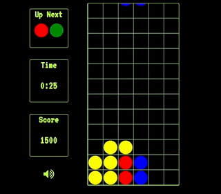

# JS Puyo

JS Puyo is a single player modification of the classic falling-block game
Puyo Pop. The player's goal is to stack the colored blobs that fall from
the top of the screen into orderly groups that can be cleared with special
breaker puyo blocks for points. The game is lost when the puyo blocks reach the top
of the screen.

## Features and Technologies

The core of this game is an easeljs stage, which renders the position of
the puyo blocks to the player and whose Ticker function handles calling the
functions that advance the game from frame to frame. Otherwise, vanilla
JS and its DOM interaction methods handle the creation of puyo blocks, player
interaction, scoring, timekeeping and updating the score and time displays
for the player.

### Collision Detection

The game detects collision by checking the distance on x and y coordinates
for each block and comparing them to the sum of the sum of their radii in
pixels. For the active puyo blocks controlled by the player, the collision detection
is performed in advance of attempts to rotate the puyo blocks, in the event
that a block would rotate into another block, the rotation fails and the
block falls as normal. Animations use their own set of coordinates, which move
towards the real coordinate of the block, preventing blocks from falling
off-center to the grid.

### Breaking Blocks

In the event that a breaker block lands, the game checks first if there are
adjacent puyo blocks of the same color, then adds those to an array of breaking
puyo blocks. For those puyo blocks in the array, the game iterates through those puyo blocks
and checks for other adjacent matching-colored puyo blocks and adds those to the
array if they are not already there.



```JS
for(let i = 0; i < breaking.length; i++){
  breaking[i].adjacentPuyos(this.grid);
  breaking[i].adjacentMatchingPuyo.forEach(puyo3=>{
    if(breaking.indexOf(puyo3) === -1){
      breaking.push(puyo3);
    }
  });
}

```

The score is then calculated and the puyo blocks are then returned to the game
instance so they can be removed from the board.

## Future Directions

0. Audio loop for game play
0. AI opponent battle mode
