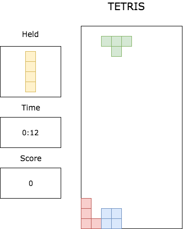

# JS Tetris
___
### About Tetris

Tetris is a game of visio-spatial awareness where a variety of shapes
comprised of four square blocks fall from the top of the screen which the
player arranges and stacks in order to create full rows at the bottom which
then disappear, scoring points. This project will replicate the game in its
classic version with a slowly increasing speed as time goes on and level
advances.

## Functionality & MVP

The game should be a working version of the classic tetris style with:
- a welcome/controls splash
- active running game board that clears when rows are completed
- shape hold area
- appropriate score/game time display.

## Wireframe

The game should replicate the usual 10x20 square board, have a display for
a held element, score/time display and a splash for the rules before the game begins.

## Architecture and packages

This project will primarily use canvas via Easel.js to render the
game state and advance the position of the falling tiles. Webpack will
be used to collate and load all files in the program

Day 1:
General set-up. Get webpack and packages set-up/n=installed. Establish a
base html document with an canvas instance. Start working with setting up
easel.

Day 2:
Establish board class and methods. Get easel ticking running. Create logic
for randomized tetramino generation, logic for switchi.ng in and out of hold
state, score and time counters, etc.

Day 3:
Inputs and splash/instructions page. Establish and test row clear logic and
animation.

Day4:
Bugfixing and styling touches. Potentially implement audio if time permits.
